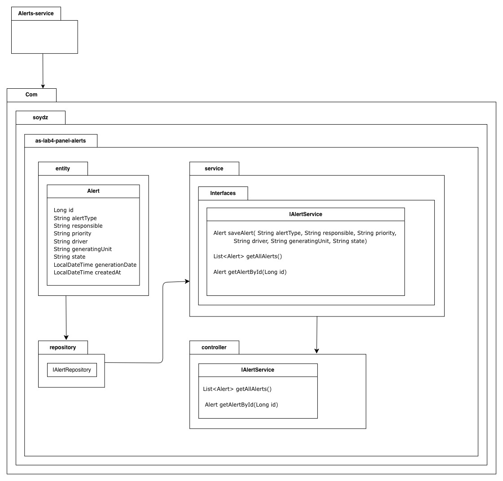
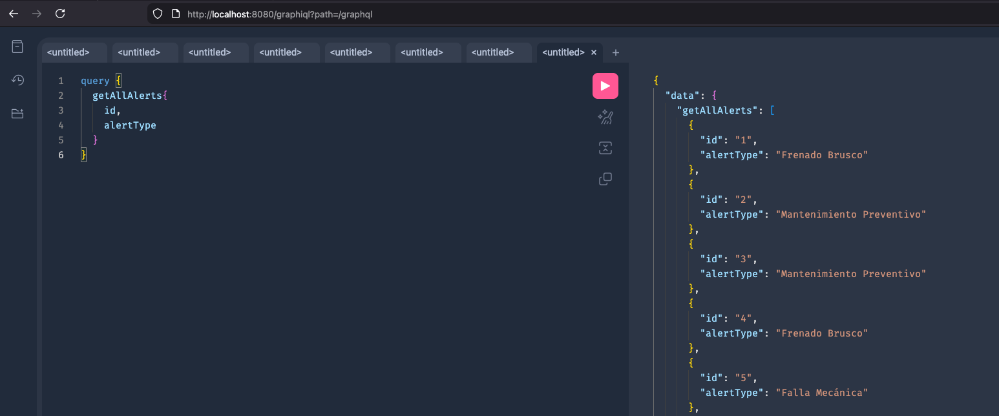
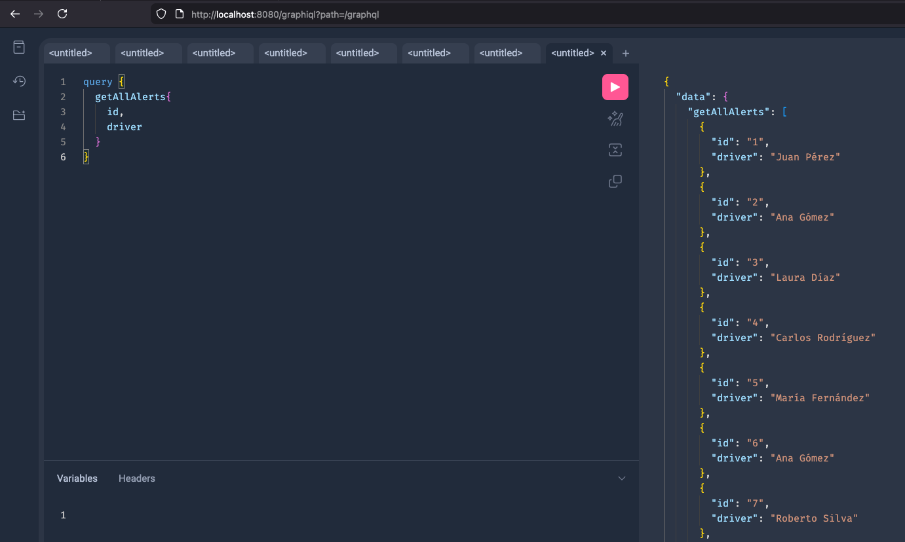
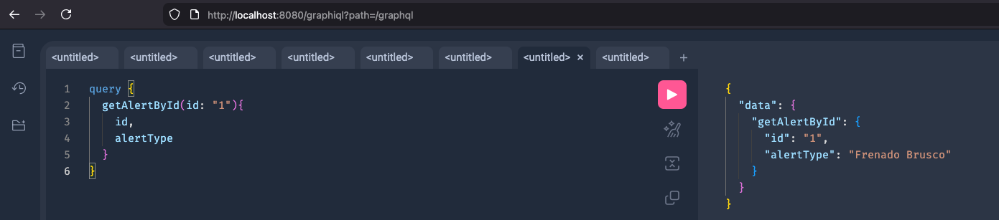
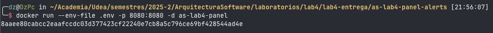
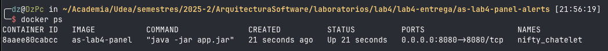

# Panel Alerts - Lab 4 - Arquitectura de Software

### Diseño API


## Documentación

### Graphiql 


### **Consulta (Query)**

#### `getAllAlerts`

**Descripción**:
Obtiene todas las alertas registradas en el sistema.

**Retorno**:
Una lista de objetos `Alert`, donde cada objeto representa una alerta.


#### `getAlertById`

**Descripción**:
Obtiene una alerta específica a partir de su ID único.

**Parámetros**:

* `id` (Tipo: `ID!`): El identificador único de la alerta a recuperar. Este parámetro es obligatorio.

**Retorno**:
Un objeto de tipo `Alert` con los detalles de la alerta solicitada.

---

### **Type `Alert`**

**Descripción**:
Representa una alerta en el sistema con los detalles relacionados con ella.

##### Campos:

* **id** (Tipo: `ID!`):
  Identificador único de la alerta. Este campo es obligatorio.

* **alertType** (Tipo: `String!`):
  Tipo de alerta, por ejemplo, "Error", "Warning", etc. Este campo es obligatorio.

* **responsible** (Tipo: `String!`):
  Persona responsable de la alerta. Este campo es obligatorio.

* **priority** (Tipo: `String!`):
  Prioridad de la alerta, por ejemplo, "Alta", "Baja", etc. Este campo es obligatorio.

* **driver** (Tipo: `String!`):
  Nombre del conductor asociado con la alerta. Este campo es obligatorio.

* **generatingUnit** (Tipo: `String!`):
  Unidad generadora asociada con la alerta. Este campo es obligatorio.

* **state** (Tipo: `String!`):
  Estado actual de la alerta, por ejemplo, "Abierta", "Cerrada", etc. Este campo es obligatorio.

* **generationDate** (Tipo: `String!`):
  Fecha y hora en la que se generó la alerta. Este campo es obligatorio.

---

### **Ejemplos de Uso de la API**

#### 1. Obtener todas las alertas:

```graphql
query {
  getAllAlerts {
    id
    alertType
    responsible
    priority
    driver
    generatingUnit
    state
    generationDate
  }
}
```

**Descripción**:
Esta consulta obtiene todas las alertas y muestra los campos especificados.

**Respuesta**:

```json
{
  "data": {
    "getAllAlerts": [
      {
        "id": "1",
        "alertType": "Error",
        "responsible": "Juan Pérez",
        "priority": "Alta",
        "driver": "Carlos Gómez",
        "generatingUnit": "Unidad A",
        "state": "Abierta",
        "generationDate": "2025-11-24T10:00:00"
      },
      {
        "id": "2",
        "alertType": "Warning",
        "responsible": "María López",
        "priority": "Baja",
        "driver": "Ana Rodríguez",
        "generatingUnit": "Unidad B",
        "state": "Cerrada",
        "generationDate": "2025-11-23T14:30:00"
      }
    ]
  }
}
```

#### 2. Obtener una alerta específica por ID:

```graphql
query {
  getAlertById(id: "1") {
    id
    alertType
    responsible
    priority
    driver
    generatingUnit
    state
    generationDate
  }
}
```

**Descripción**:
Esta consulta obtiene los detalles de una alerta específica usando su ID.

**Respuesta**:

```json
{
  "data": {
    "getAlertById": {
      "id": "1",
      "alertType": "Error",
      "responsible": "Juan Pérez",
      "priority": "Alta",
      "driver": "Carlos Gómez",
      "generatingUnit": "Unidad A",
      "state": "Abierta",
      "generationDate": "2025-11-24T10:00:00"
    }
  }
}
```

## Pruebas de la API

### Obtener todas las alertas



### Obtener una alerta específica por ID




## Docker

### Dockerfile
```dockerfile
# Construcción: Usando una imagen de Maven para construir el proyecto
FROM maven:3.9.9-eclipse-temurin-21 AS builder
# Establece el directorio de trabajo dentro del contenedor
WORKDIR /app

# Copia el archivo pom.xml al contenedor para resolver las dependencias
COPY pom.xml ./

# Descarga las dependencias de Maven sin ejecutar las pruebas, para preparar el proyecto offline
RUN mvn dependency:go-offline -B

# Copia todo el código fuente del proyecto al contenedor
COPY src ./src

# Construir el archivo JAR sin ejecutar pruebas, solo el empaquetado
RUN mvn clean package -DskipTests -B

# Runtime: Usando una imagen de temurin 21 para ejecutar el JAR
FROM eclipse-temurin:21-jdk
WORKDIR /app

# Copia el JAR construido desde la etapa de construcción
COPY --from=builder /app/target/*.jar app.jar

# Ejecucción del JAR
ENTRYPOINT ["java", "-jar", "app.jar"]
```

Creamos la imagen Docker apartir del Dockerfile
y definimos el nombre como `as-lab4-panel`


Se usa un archivo `.env` para configurar las variables de entorno en Docker,
lo que permite gestionar la configuración de manera más flexible y segura.
Al emplear un archivo `.env`, se evita la práctica de **'hardcodear'** valores directamente en el código,
lo que facilita el mantenimiento y la portabilidad de la aplicación.
Además, esta técnica ayuda a proteger información sensible, como secretos o credenciales,
al mantenerlos fuera del código fuente y no exponerlos accidentalmente.


